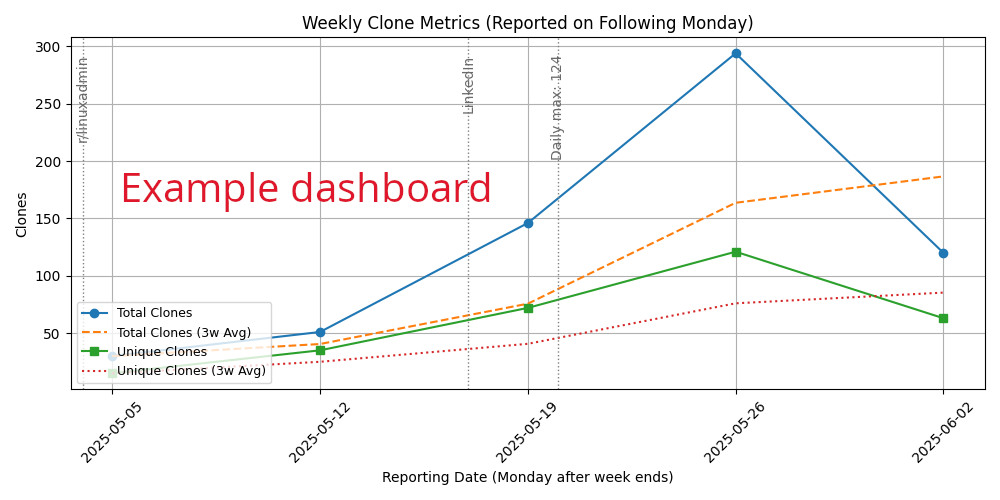

# ClonePulse

**Your GitHub clone stats, visualized and celebrated.**  
Track weekly trends, highlight milestones, and share visual dashboards—all automatically.

[](https://github.com/per2jensen/clonepulse/generate)


---

## What is ClonePulse?

`ClonePulse` is a GitHub-friendly toolchain that fetches, tracks, and visualizes repository clone activity.

It offers:

- **Daily clone tracking** (total + unique)
- **12-week visual dashboard** (.PNG image)
- **Automatic milestone detection** (e.g., 500, 1K, 2K+ clones)
- **Auto-annotations** for clone spikes
- **Badge generation** for README inclusion
- **GitHub Actions** support for automation

---

## Example badge setup

[](https://github.com/per2jensen/clonepulse/blob/main/clonepulse/weekly_clones.png)
[](https://github.com/per2jensen/clonepulse/blob/main/clonepulse/weekly_clones.png)

---

## 🏷️ ClonePulse Badge Snippet

```text
[](https://github.com/<your-username>/<your-repo>/blob/main/clonepulse/weekly_clones.png)

[](https://github.com/<your-username>/<your-repo>/blob/main/clonepulse/weekly_clones.png)
```

### Instructions

Replace \<your-username\> and \<your-repo\> with your actual GitHub handle and repository name.

Ensure the `fetch_clones.yml` and `generate_clone_dashboard.yml` GitHub Actions are set up, enabled and working. Run them manually to check.

The badges will auto-update based on your repo's clone activity, and clicking the badges will show the latest dashboard.

---

## 📷 Example Dashboard

> A weekly clone activity chart is automatically updated and saved in `doc/weekly_clones.png`.

It is intended to run every Monday morning. Data from the current week is discarded - only data for full weeks are shown.



---

## 🔐 Creating a Secure GitHub Token for ClonePulse

ClonePulse fetches traffic (clone) stats from the GitHub API. This requires a Personal Access Token (PAT) with read-only access to `Read access to administration and metadata`. Here's how to create one securely and use it with GitHub Actions.

### Token Requirements

For public repositories, a fine-grained token with `Read access to administration and metadata` access is sufficient.

For private repositories, you will also need:

- Repository contents: Read-only
- Repository metadata: Read-only
- Repository traffic: Read-only

### How to Create a Fine-Grained Token

Visit: https://github.com/settings/tokens

Click "Generate new token" → "Fine-grained token"

Configure:

Name: e.g., `\<your reposity\>_ClonePulse`

Expiration: e.g., 90 days

Resource owner: Your user or organization

Repository access: Select the **specific repo**

Permissions put on the token:

- "Administration": Read-only
- "Metadata":  Read-only
- For Private repos you might need more.....

Click "Generate token" and copy the value of the token to secure storage immediately. You onby see it once.

### 🔒 Overview of securing the Token Using GitHub Secrets

After having created the secret, you must now put it into the repository where you want to use it.

1. Go to your GitHub repository:  
   **Settings → Secrets and variables → Actions → New repository secret**

2. Name the secret:  
   `CLONEPULSE_METRICS`

3. Paste the token you copied and save.

### GitHub Action workflow `fetch_clones.yml`

The workflow references the secret as an environment variable:

```yaml
- name: Run fetch_clones.py
  env:
    TOKEN: ${{ secrets.CLONEPULSE_METRICS }}
  run: python src/clonepulse/fetch_clones.py
```

The workflows must be enabled and perhaps the crontab needs adjusting to your taste.

## Installation (dev setup)

```bash
# python3 and a few packages are needed.
# This works on Ubuntu 24.04
sudo apt update
sudo apt install -y git python3 python3-venv python3-pip

git clone https://github.com/your-user/clonepulse.git
cd clonepulse
./build.sh  # Creates virtualenv and installs dependencies
```

## Contributing

Found a bug or have a suggestion?  
Feel free to [open an issue](https://github.com/per2jensen/clonepulse/issues) or submit a pull request!
