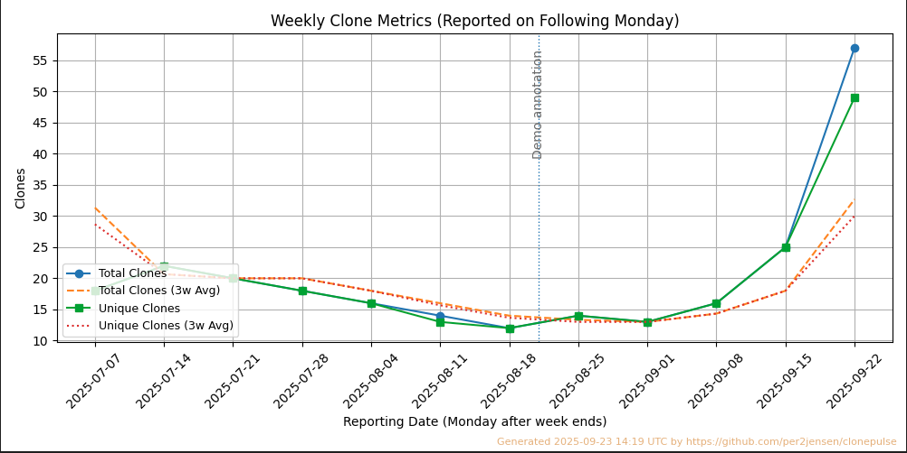
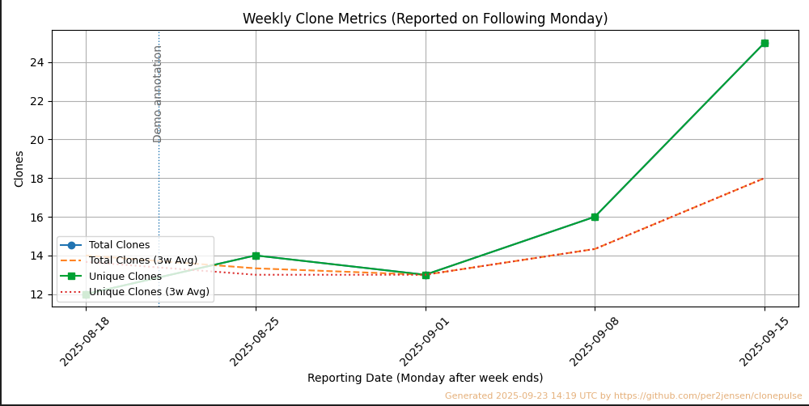
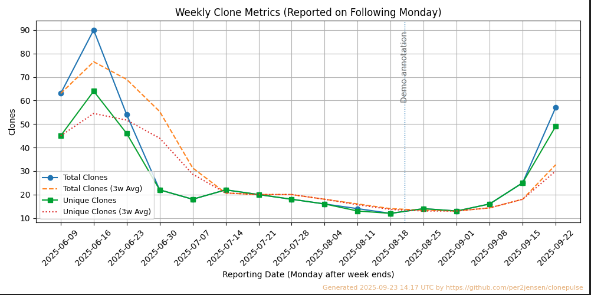

# ClonePulse

**Your GitHub clone stats, visualized and celebrated.**  
Track weekly trends, highlight milestones, and share visual dashboards—all automatically.

[](https://github.com/per2jensen/clonepulse/generate)  


---

## Add Badges to Your README

ClonePulse can generate badges you can embed in your repo:

[](https://raw.githubusercontent.com/per2jensen/clonepulse/main/clonepulse/weekly_clones.png)  
[](https://raw.githubusercontent.com/per2jensen/clonepulse/main/clonepulse/weekly_clones.png)

A click on a badge takes you to the dashboard.

---

## Clone data summary and outlier handling

`clonepulse/fetch_clones.json` starts with a `summary` object containing filtered
lifetime totals, raw clone totals, 7-day and 30-day totals and daily averages,
and a snapshot of the totals at the last refresh. Rolling periods end on the
newest stored day; `days_included` and `days_discarded` make each average's
denominator explicit.

ClonePulse marks a day as abnormal when its clone-to-unique-cloner ratio is
greater than `25`. A positive clone count with zero unique cloners is also
abnormal. These days remain in `daily` with their raw values and are described
in `discard`, but they do not contribute to summaries, badges, milestones, or
the daily-max annotation. The dashboard replaces an abnormal clone count with
the rounded average of up to seven preceding normal days.

```json
{
  "summary": {
    "total_clones": 4437,
    "unique_clones": 2934,
    "total_clones_raw": 4437,
    "last_7_days": {
      "total_clones": 37,
      "unique_clones": 29,
      "average_daily_clones": 5.29,
      "average_daily_unique_clones": 4.14,
      "days_included": 7,
      "days_discarded": 0
    },
    "last_30_days": {
      "total_clones": 197,
      "unique_clones": 143,
      "average_daily_clones": 6.57,
      "average_daily_unique_clones": 4.77,
      "days_included": 30,
      "days_discarded": 0
    },
    "last_refresh": {
      "timestamp": "2026-08-29T02:29:25Z",
      "total_clones": 4437,
      "unique_clones": 2934
    }
  },
  "annotations": [],
  "discard": [],
  "daily": []
}
```

---

## Example dashboards

### Weekly dashboard (default)
A weekly clone activity chart is automatically updated and saved in `clonepulse/weekly_clones.png`.

- Runs every Monday morning
- Discards partial weeks
- Shows only complete Monday–Sunday periods


<sub>Command: `python src/clonepulse/generate_clone_dashboard.py --user per2jensen --repo clonepulse`</sub>


### Reproducible window (`--start` + `--weeks`)
  
<sub>Command: `python src/clonepulse/generate_clone_dashboard.py --start 2025-09-01 --weeks 8  --user per2jensen --repo clonepulse`</sub>

### Calendar year (`--year`)
  
<sub>Command: `python src/clonepulse/generate_clone_dashboard.py --year 2025 --user per2jensen --repo clonepulse`</sub>

---

## Quick Setup

1. **Create a GitHub Token**  
   See [🔐 Token Setup](#-token-setup) below.

2. **Drop essentials into your repo**  
   Copy the contents of `clonepulse/` and `src/clonepulse/` plus the workflows in `.github/workflows/`.

3. **Add badges to your README**  
   Replace `your-username/your-repo`:

   ```markdown
   [](https://github.com/your-username/your-repo/blob/main/clonepulse/weekly_clones.png)

   [](https://github.com/your-username/your-repo/blob/main/clonepulse/weekly_clones.png)
   ```

4. **Configure the workflow**  
   Update `fetch_clones.yml` with your `--user` and `--repo`.

   ```yaml
   - name: Run fetch_clones.py
     env:
       TOKEN: ${{ secrets.CLONEPULSE_METRICS }}
     run: |
       PYTHONPATH=src python src/clonepulse/fetch_clones.py \
         --user <your GitHub login> \
         --repo <your repo>
   ```

5. **Generate the dashboard in your workflow**  

   Default (last 12 weeks):

   ```yaml
   - name: Render dashboard
     run: PYTHONPATH=src python src/clonepulse/generate_clone_dashboard.py
   ```

   Reproducible window:

   ```yaml
   - name: Render dashboard
     run: |
       PYTHONPATH=src python src/clonepulse/generate_clone_dashboard.py \
         --start 2025-06-02 --weeks 8
   ```

   **Dashboard title & repo label**  
   - Banner title always says “Weekly Clone Metrics”.  
   - If you provide `--user` and `--repo`, the banner also shows `user/repo`.
   - If only one is provided, that single value is shown.  
   - If neither flag is passed, the script falls back to env vars `GITHUB_USER` / `GITHUB_REPO` for the label.

   **Additional CLI options** (can also be used locally):

   ```bash
   PYTHONPATH=src python src/clonepulse/generate_clone_dashboard.py \
     [--user your-username] \
     [--repo your-repo] \
     [--start YYYY-MM-DD --weeks N] \
     [--year YYYY]
   ```

---

## Token Setup

ClonePulse fetches traffic stats from the GitHub API. This requires a Personal Access Token (PAT).

### Permissions

For **public repos**:
- Administration: Read-only
- Metadata: Read-only

For **private repos**:
- Administration: Read-only
- Metadata: Read-only
- Contents: Read-only
- Traffic: Read-only

### How to Create the Token

1. Visit [https://github.com/settings/tokens](https://github.com/settings/tokens)  
   Click **Generate new token → Fine-grained token**

2. Configure:
   - Name: e.g. `your-repo_ClonePulse`
   - Expiration: e.g. 90 days
   - Resource owner: Your user or organization
   - Repository access: select your repo
   - Permissions: set as above

3. Generate and copy the token. (You only see it once.)

### Add Token to Secrets

1. Go to your GitHub repository:  
   **Settings → Secrets and variables → Actions → New repository secret**

2. Name the secret:  
   `CLONEPULSE_METRICS`

3. Paste the token and save.

### Use in Workflow

```yaml
- name: Run fetch_clones.py
  env:
    TOKEN: ${{ secrets.CLONEPULSE_METRICS }}
  run: python src/clonepulse/fetch_clones.py
```

---

## Contributing

Found a bug or want to suggest a feature?  
[Open an issue](https://github.com/per2jensen/clonepulse/issues) or send a PR.

---

## License

ClonePulse is licensed under [MIT](LICENSE).
